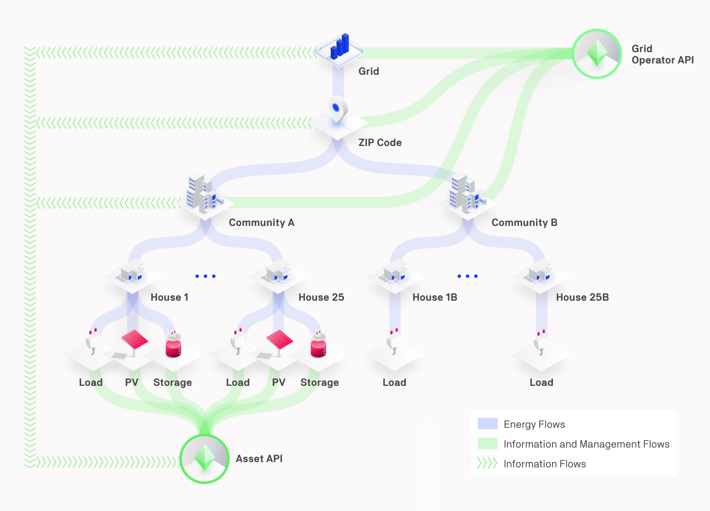

##Definition
To enable users to interact with a running collaboration or a canary test network, two different application interfaces (APIs) are available. The [Asset API](assets-api.md) allows the user to manage multiple energy assets by implementing custom trading strategies. The [Grid Operator API](grid-operator-api.md) allows the user to manage multiple markets by implementing custom grid fee strategies. Both interfaces allow strategies to incorporate market and asset statistics. Two examples of template API scripts are available in the Grid Singularity’s GitHub repository: [Asset API](https://github.com/gridsingularity/d3a/blob/master/src/d3a/setup/odyssey_momentum/assets_api_template.py) and [Grid Operator API](https://github.com/gridsingularity/d3a/blob/master/src/d3a/setup/odyssey_momentum/markets_api_template.py).  These two APIs interact with Grid Singularity simulations through the open source Grid Singularity’s [API client](https://github.com/gridsingularity/d3a-api-client). 



##API Client Installation##

_Note:_ If you are running the Grid Singularity energy exchange engine (D3A) using a virtual machine and `vagrant`, the latest `api-client` is already installed on your machine and you can skip to the [Launch Simulation](api-overview.md#launch-simulation) section below. If you are running the engine locally, please follow the following instructions.

###Install Redis server. Open a new terminal and type

```
brew install redis
```

###Install d3a-client

```
mkvirtualenv d3a-api-env
pip install git+https://github.com/gridsingularity/d3a-api-client.git
```

###Update d3a-client (as needed when an update is deployed)

```
pip uninstall d3a-api-client
pip install git+https://github.com/gridsingularity/d3a-api-client.git
```

##User Interface

To connect the API to simulations, the user needs to register and be approved for a collaborative simulation by following these [steps](collaboration.md#how-to-connect). Once the user successfully registers for the relevant assets or markets, the user needs to adapt their API scripts. 

##Backend

###Start Redis server

To use the API locally, your script interacts with the simulation using a local Redis instance. To start the redis instance, open a new terminal and run the following command :

```
redis-server /usr/local/etc/redis.conf
```

###Open external connection to API for Assets

In the setup file (template available [here](https://github.com/gridsingularity/d3a/blob/master/src/d3a/setup/odyssey_momentum/odyssey_training.py)), an asset must be designated as **open to external connection** via the API. This is controlled when setting up the simulation in the setup file by designating the ExternalStrategy for each relevant energy assets :


```python
Area( 'house-1-s',
              [
                     Area('h1-load-s', strategy=LoadProfileExternalStrategy(daily_load_profile=load1,
                                                                             initial_buying_rate=Houses_initial_buying_rate,
                                                                             use_market_maker_rate=True)
                     ),

                     Area('h1-pv-s', strategy=PVUserProfileExternalStrategy(power_profile=pv1,
                                                                             initial_selling_rate=PV_initial,
                                                                             final_selling_rate=PV_final)
                     ),

                     Area('h1-storage-s', strategy=StorageExternalStrategy(initial_soc=50)
                     ),

               ], grid_fee_percentage=0, grid_fee_const=0, external_connection_available=True
           ),

```

By default, trading strategies do not allow API connections unless the `ExternalStrategy` is used. Please also ensure that the appropriate libraries are imported to use the API (as in the template setup file provided).

###Open Markets for external connection

The API supports multiple markets managed with the [Grid Operator API](grid-operator-api.md). Access is controlled when setting up the simulation, using the `Area` class’ boolean argument called external_connection_available:

```python
Area(
         'Member 2',
         [ ... ], # Children of the area
         external_connection_available=True
),
```

If set to true, the area allows all of its submarkets and assets to request the the area’s market statistics through the API. By default, this `external_connection_available` is set to `False`.

###Launch simulation

This requires you to have the backend codebase installed on your machine to run simulations (see installation instructions). First navigate to the D3A folder in a new terminal, then activate the D3A environment with the command:

`workon d3a`

Then run:

`d3a -l INFO run -t 15s -s 15m --setup odyssey_momentum.odyssey_training --start-date 2014-10-01 --enable-external-connection`

After a few seconds, trading should begin, resembling the figure below. 


##Initialise and start the API :

Before launching the API script, the user needs to adapt the following information in their script (script template available here) : 

###Oracle name

This parameter is only relevant when using the API on the User-Interface. This defines the name of the aggregator / API name that manages the markets and energy assets. Once the name is set it cannot be changed within the same running collaboration.

```
oracle_name = 'oracle'
```


###Assets/markets list

The list of assets / markets needs to be updated to include the assets registered to user through the registration process, in arrays as follows:

```python
load_names = ['Load 1', 'Load 2']
pv_names = ['PV 1']
storage_names = ['Storage 1']
```

```python
market_names = ["Grid", "Community"]
```

###Environment setting : 

The user needs to define if the simulation is run locally (using the backend and redis) or on User-Interface.

If it is run on the [backend](https://github.com/gridsingularity/d3a) the user needs to set : 

```python
RUN_ON_D3A_WEB = False
```

If it is run on the [UI](https://www.d3a.io/) the user need to set the parameter to `True` and specify the simulation ID (found in the simulation’s URL) : 

```python
RUN_ON_D3A_WEB = True 
simulation_id = '9682dc94-ad8f-4661-bfbb-a3b8a3b209a9'
```

Once the script is adapted, the user can launch it with the following command, replacing the template name with the updated script’s name :

```
python assets_api_template.py
```
