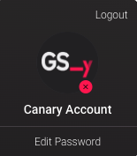

The Singularity Map is an interactive Grid Singularity exchange simulation platform where users can model and simulate digital twins (digital representations) of their communities. Users add household (or buildings) energy assets such as, consumption profiles, solar panels (PVs), and / or storages (batteries), which are represented by trading agents, trading energy according to  user preferences. The purpose of the simulation is to configure and optimise the local energy market structure digitally before bringing the energy communities to reality through a physical deployment.

***Figure 2.1***. *The Singularity Map - Grid Singularity Exchange web-based interface at [https://map.gridsingularity.com/singularity-map](https://gridsingularity.com/singularity-map).*

The map includes a search bar in the top left corner, a list of simulations in the extendable panel below the search bar, user icons on the right hand side of the screen (explained below) and coloured dots representing different simulations on the map.

**Icons**

 This icon allows the user to reorient their view of the map to the standard north-facing direction.

 These icons allow users to zoom in and out of the map.

 This icon allows access to the user's location.

 These icons allow users a change of view between birds eye view (straight down/2D) and 3D.

 This icon allows the user to see their assets in a list view and to click on the items in the list in order to navigate the map and results views

 This icon allows the user to request upgrading their simulation to the Canary Network

**Legend**

***Figure 2.2***. *Legend explaining colouring for the energy import / export*

The coloured dots on the map represent energy community simulations. A legend on the top right

🟢 Green dots are communities that have a net export of energy.

🔴 Red dots are communities that have a net import of energy.

🔵 Blue dots are communities that have a neutral energy balance (neither net import/export) or haven’t been simulated yet.

**Profile configuration**

By clicking on the icon in the top right corner next to “Run Simulation”, users can see their profile, edit their password, and change their profile picture by clicking on the image and uploading a file from their computer (as shown in the picture below).

***Figure2.3.*** *User profile in the Singularity Map*

***Building a Community to simulate***

To build a community, the user should take the following steps:

1. Choose location - The first step is to choose the location for the community. Users can find their location by manually navigating the map or by typing their location in the search bar.

2. Add homes (or other buildings) and energy assets - Once a location has been selected, users can start building their community by adding homes and energy assets. A community must have at least two homes before it can be saved and local energy trading simulated.

3. Log in or register an account.

4. Name the community, set the simulation period and save it.

5. Run the simulation and view the results.

A guided onboarding of this process launches automatically on the top right hand side of the screen for new users.

***Figure 2.4***: *Guided Onboarding Feature*

Users can show/hide this feature by clicking on the  icon at the top of the icon list on the right hand side of the screen. This icon and feature only appear after a user has chosen their location and selected the first button to start building their community.

***Figure 2.5***: *The first button a user selects to start building their community.*
