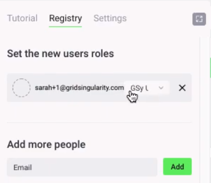
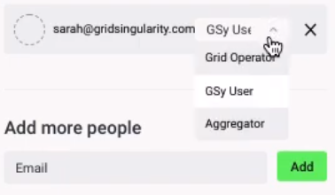
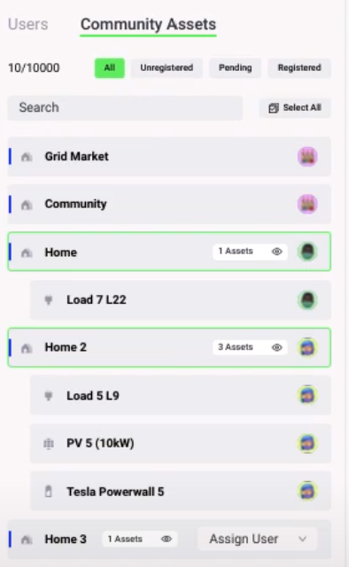

## Connect to a Grid Singularity Canary Test Network

The Grid Singularity Canary Test Network, inspired by the “canary in a coal mine”, is designed to test new ideas while operating in conditions as close as possible to reality. Energy assets, managed by aggregators, send their actual energy usage through the [Asset API](asset-api-template-script.md) each 15 minutes (or another specified timeframe depending on the determined spot market length) and the exchange operates in real-time to facilitate local energy markets. However, the network does not represent actual energy and financial transactions because the assets’ virtual representations (digital twins) are decoupled in state from their physical (e.g. a battery’s digital twin might have a different state of charge in simulation vs. reality).

To create a Grid Singularity Canary Test Network, follow these steps (a video tutorial is also available [here](https://www.youtube.com/watch?v=8tAl8Td2XsU&list=PLdIkfx9NcrQeD8kLBvASosLce9qJ4gQIH&index=2)):

- Select the Simulation that you want to set up as a Canary Test Network. Once your simulation has completed, click on settings, and click *Go* in the box that says, “bring your simulation closer to reality”.

   *A Grid Singularity agent will be in touch with you shortly after to lead you through setting up a Canary Network. Currently, this step requires manual Grid Singularity intervention. A personal account of an external user does not have the admin rights to create a Canary Test Network. If you have any questions, please contact us at [contact@gridsingularity.com](mailto:contact@gridsingularity.com) for technical support and provide us with the following:*

  - *Your Name*
  - *Grid Singularity account email address*
  - *Company name*
  - *Location of the community*
  - *Size of the community (number of participants, assets)*
  - *Energy Supplier / grid operator*
  - *Purpose of the canary network*
  - *Simulation name*

   Once Grid Singularity has approved your request, follow the steps below:

- With the creation of a Canary Network, a *Registry* tab has been added next to settings in the sidebar. Each homeowner or asset owner can be assigned to a home and invited to participate in the Canary Network by email through the *Add More People* invitation tool by the Canary Network owner. Once they accept the emailed invitation, they will be able to view the simulation and their assets through the *Registry*.

- The Canary Network owner can also set *User Roles* for each user. Invited people default to *GSy User*, allowing them to view and analyze results for their owned assets.

- *Aggregators* must login and register to trade on behalf of each asset on the *Community Assets* tab. Once their registration is accepted by the simulation owner, they can trade on behalf of assets through the [Asset API](https://gridsingularity.github.io/d3a/assets-api/).

- The *Grid Operator,* once registered, has access to manage grid fees and network congestion through the [Grid Operator API](https://gridsingularity.github.io/d3a/grid-operator-api/)*.*
- Connect live data streams to the energy exchange (see section [below](https://docs.google.com/document/d/1B1aFLsB5NqrXMnSb4fpMaN84vsXUo1LigS0zCJpZLHo/edit#heading=h.lu5xu9ls176)).
