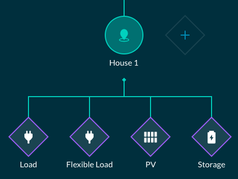
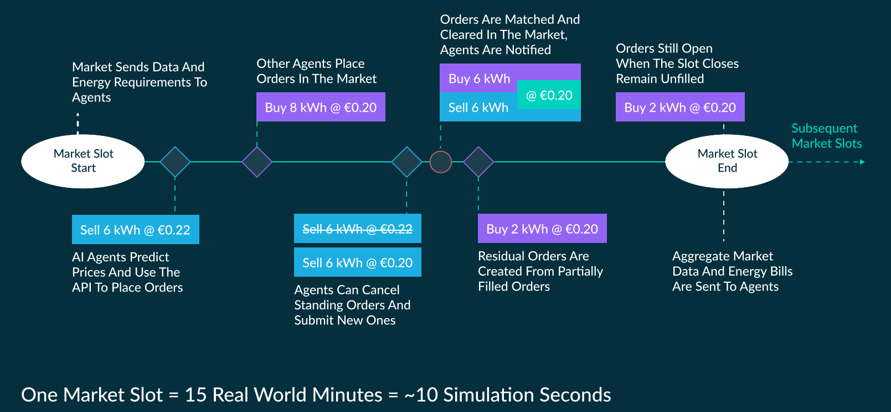
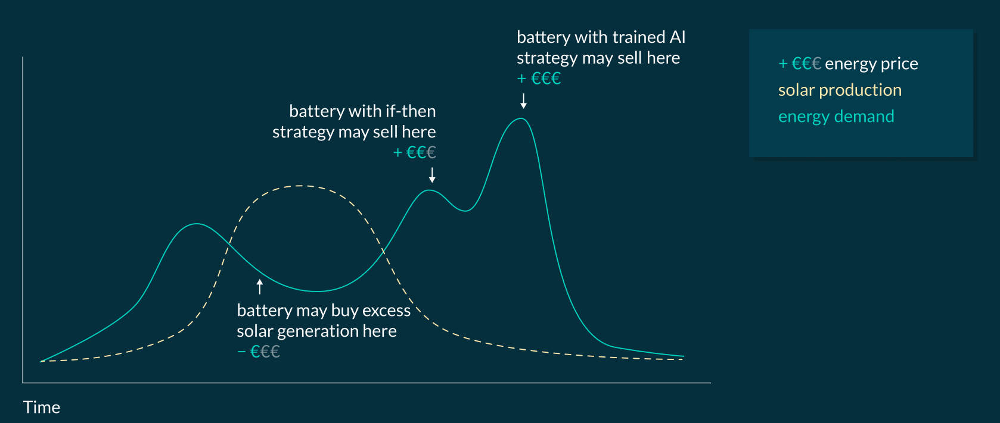

This is a frequently asked questions (faq) specifically designed for the hackathon Odyssey 2020, in which we are producing 2 of the challenges.

# Stream 1: Trading Bots, KPIs, API

### What is the D3A ? 
The D3A is an open source software that enables users to model, simulate, optimise, download, and deploy energy exchanges. The D3A is designed to build “digital twin” representations of physical energy systems and energy markets. It aims to build open energy exchanges, extending access for new energy players, a class which is growing due to increased investments in distributed energy resources and smart devices. By creating energy exchanges from bottom to top, smart, local, and flexible devices as well as distributed renewable generation can be monetised for a faster transition to 100% renewable energy.

### How are D3A market organised ?

{:style="float: right;;margin-left: 20px;margin-right: auto;height:400px;width:280px"}

* The **electricity grid** is organized into a hierarchy of energy marketplaces. 

* **Markets** are organized according to grid voltage levels.

* Energy **assets** buy and sell into a House Market. Houses buy and sell into **Community** Markets. Communities buy and sell into a **Grid** Market.

* Each energy asset consumes, produces, or stores energy and trades in its local energy market first. If unsuccessful, the bid or offer is propagated to a higher market in the hierarchy.

* Energy assets, Houses, and Communities might optimise their bids and offers for a specific **metric**, such as minimising energy bill or maximising self-sufficiency.

### What is the Goal of Energy Singularity Challenge Stream 1?

Stream 1 of the Energy Singularity challenge aims to optimize the trading strategies of individual devices with the goal of optimising key performance indicators (KPIs) such as a household’s energy bill and a community’s self-sufficiency.

Teams will design and manage trading strategies of individual assets within houses or communities through an API.

Each team will manage the assets of one or many homes in a community, depending on the challenge round. They will be judged on KPIs such as energy bill or energy self-sufficiency, but also on their approach and viability of their agent’s ‘deployability’.

Grid operators can adjust grid tariffs and transmission capacities in real-time, and utilities can compete in the market, offering energy from power plants at a competitive rate (these roles will be performed by challenge partners).

### What are energy assets and how are they represented?

There are five types of energy assets modeled. Four are home energy assets.
{:style="display: block; align:center; margin-left: auto;margin-right: auto;height:220px;width:300px"}

1. **Loads** have a variable energy demand (kWh) that must be purchased within each market slot

2. **PVs** have variable energy generation that can be sold within each market slot

3. **Batteries** can buy or sell energy, within a min and max state of charge

4. **Flexible Loads** can buy flexibly by storing energy to use later, but must cover their base load over time

    The fifth is controlled by an agent representing a utility:

5. **Power Plants** produce energy at a market maker rate (e.g. 30 cents per kWh) and act as ‘infinite’ producers

Energy required to be purchased (Loads), energy available to be sold (PVs), and state of charge and available rate of charge / discharge (Batteries and Flexible Loads) will be provided through the API each market slot.

### What market mechanisms will be used in the Hackathon ?

Without a peer to peer energy market, devices that consume energy would always buy energy at the market rate of 30 cents per kWh from the utility. PVs would sell excess energy to the utility at a feed-in tariff rate, such as 10 cents / kWh. 

In a peer to peer market, a PV would be able to sell energy to a nearby load instead of selling it to the grid. For example, the PV may offer to sell its excess energy at 25 cents / kWh to the load, 15 cents higher than the feed-in tariff. The load would likely be willing to buy this energy, as the cost is 5 cents lower than the 30 cent market rate from the utility, a benefit for both the PV and load.

The exact value of the rate which the PV would sell to the load is optimally a function of energy supply and demand and is likely to decrease during times when there is more solar production than required load. Agents will try to predict this optimal price and arbitrage the energy market with their trading strategies.

Markets are broken into 15 minute slots. Within each slot, an energy asset is able to post bids or offers for energy. These bids or offers are matched based on the market type. The [two sided market Pay-as-Bid](two-sided-pay-as-bid.md) market type will be used for the hackathon, where bids are matched with the highest price offer where bid price >= offer price. If all remaining bid prices are less than all offer prices, the energy on bid / offer remains unmatched. Any energy not bought or sold at the end of the market slot vs. energy requirements of the assets will be penalised. 

Each market slot is broken into many ticks. When a bid or offer is posted, it is first attempted to be matched in its local energy market. If it remains unmatched at the end of one tick, it is propagated to a higher market. Bids or offers that match are immediately cleared in all markets, and bids and offers that are canceled are immediately canceled in all markets. 

The duration simulated for each round will be 1 week and each market slot will be 15 minutes of simulated time. Simulations will be accelerated and each market slot will only take a few seconds in “real life”.

A walk-through of one market slot is depicted below.

For more information on the market and its component, please visit these wiki pages :

1. [Overview](markets.md)
2. [Pay-as-Bid](two-sided-pay-as-bid.md)
3. [Inter-Area Agent](inter-area-agent.md)
4. [Market slot and ticks](market-slots-and-ticks.md)

### What is a trading strategy and how do I optimise it ?

Each energy asset is represented by a digital twin agent. The agent makes decisions to buy or sell energy at specific prices based on the energy requirements of the device. For example, a solar panel that produces 0.15 kWh of energy may request to SELL 0.15 kWh at 26 cents / kWh. Loads must buy a certain amount of energy. PVs must sell the amount of energy they produce. Batteries may buy or sell energy within a min and max state of charge.

Each team will manage multiple energy assets. The goal is to optimize the trading strategy for a specific metric (that can either be the energy bills or the [self-sufficiency](kpis.md) of an area) by defining the price [€/kWh] and the volume [kWh] of your bids/offers. If you are controlling storage there is also the factor of time that comes into consideration (when to buy or sell) when optimizing, as illustrated in the figure below.

Furthermore, since the market is continuous, you are also able to update your bids/offers during the market slot in order to increase your chance of being matched.

### What data is available to train my trading bot ?

Data can be gathered in two ways, by:

1. Gathering and locally storing the information passed to the agent through the API during simulations
2. Processing the data outputs of simulations (exported to the `d3a-simulation` folder after each simulation)

The information passed through the API is what will be available to be used in collaborative simulations such as at the hackathon. It is recommended your agents be trained on this data. Data includes past market data (min, max, avg, and median prices), amount of energy traded, trading events, and power curves. Exact data structures are available in the [API documentation](assets-api.md).

### What are penalties and how are they avoided?

Penalties are incurred if the power curve of a device is not exactly met. The penalty for any energy withstanding is currently set to the market maker rate + 10%, but is subject to change.

For example if a load is required to buy 1 kWh but only buys 0.8 kWh, the remaining 0.2 kWh will be penalised at the market maker rate + 10%. The same is true if a PV generates 1 kWh but only sells 0.8 kWh. 

This is to penalise unaccounted for power flow that could be detrimental to the physical grid.

### What is a Grid Fee ?
A grid fee is a [percentage](percentage-fees.md) of trade price or a [constant value](constant-fees.md) that is paid to the market for using the electrical grid.

## Simulation and API Setup

### How do I create a simulation and train and test my trading bot ? 

You will train your agent locally on the backend code, and will interact with the frontend at [d3a.io](http://d3a.io/) during the hackathon.

Review this document describing how to install and interact with simulations via the [API](assets-api.md), which discusses connecting to the backend and to d3a.io.

To run simulations on our frontend at d3a.io, follow the steps on our wiki to [create and run simulations on d3a.io](faq.md#how-do-i-setup-a-simulation-in-the-frontend).

## Technical information

Please note that this information is subject to change as the challenge details are refined.

### How many days are in each simulation ?

It is likely that each simulation will represent 7 real time days.

### How much time does a market slot take ?

Each market slot represents 15 simulation time minutes which is 5-10 real time seconds. The exact simulation slowdown factor will be shared when decided upon.

### How many [ticks](market-slots-and-ticks.md) are in a market slot ?

In each market slot there will be 60-90 ticks. The `on_tick(self, tick_info)` function will be triggered every incremental 10% of the market slot, e.g. on tick 6, 12, 18, etc. if there are 60 ticks. This means you’ll easily be able to make bid and offer decisions / updates 9 times per slot.

### How many API calls can I make per market slot ? 

### Each device may have up to 5 active bids and 5 active offers at any point in time. There will be a realistic limit on the number of API calls, such as 1000 per slot, which will not limit your agents and is only intended to limit the probability of a DDOS attack. The exact number is to be determined and will be shared.

### How many accounts can register for one device ?

Multiple accounts can apply for a device but only one will be selected by the simulation’s grid operator, registered to a device and can send API calls.

### Do I have to run a single strategy for all my devices ? 

A single script could be used to manage all devices, but it is not obligatory. You can easily run multiple scripts with various strategies on your computer via multiple terminals. 

## Defining Success

### What criteria will teams be judged on?

Winners will not be decided purely on how well their trading algorithm performs relative to other teams. Teams will be judged on a combination of:

1. **Algorithm Success**: the success of their TradingBot against defined metrics such as energy bill and community self-sufficiency, the goal being specified each challenge round

2. **Algorithm Approach**: the explanation / documentation of why their algorithm is performing the way it does, and what that means for the devices and communities it represents

3. **Challenge Questions**: answers or approaches to the challenge questions as defined below. Not all questions must be attempted, especially if you have very well thought out answers to a subset of the questions

### What are the challenge questions?

1. **Requirements for Intelligent Agents in the Real World** - What information must be provided to intelligent agents who are trying to optimise the performance of energy devices they represent in the real world? What are some potential issues, such as privacy concerns or hardware limits? What should the flow of information look like?

2. **Calculate the Return on Investment of installing an energy asset** - Given simulation outcomes, how could the return on investment of energy assets be determined? The intent would be to answer the question, “should I buy a battery or a solar panel, and what would be the benefit?”.

3. **Community Index Design** - Design a KPI that could be used to determine the effectiveness index of the way a community is interacting with the energy grid, taking into account energy bill, self-sufficiency, self-consumption, active devices, and other inputs. This index could then be used to judge communities or as an optimisation metric for trading algorithms.

