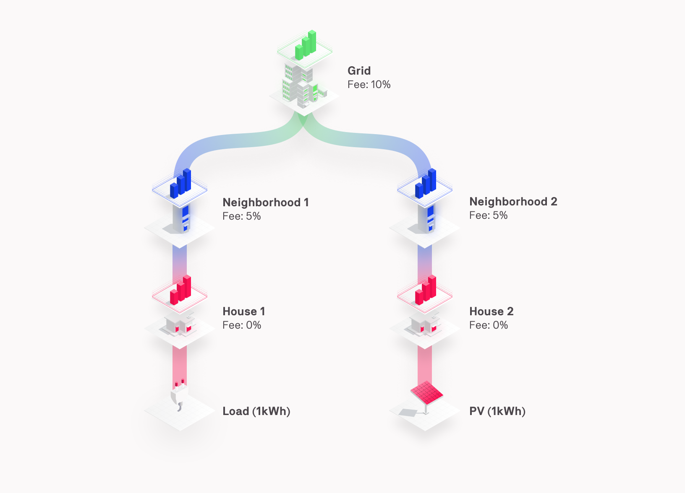
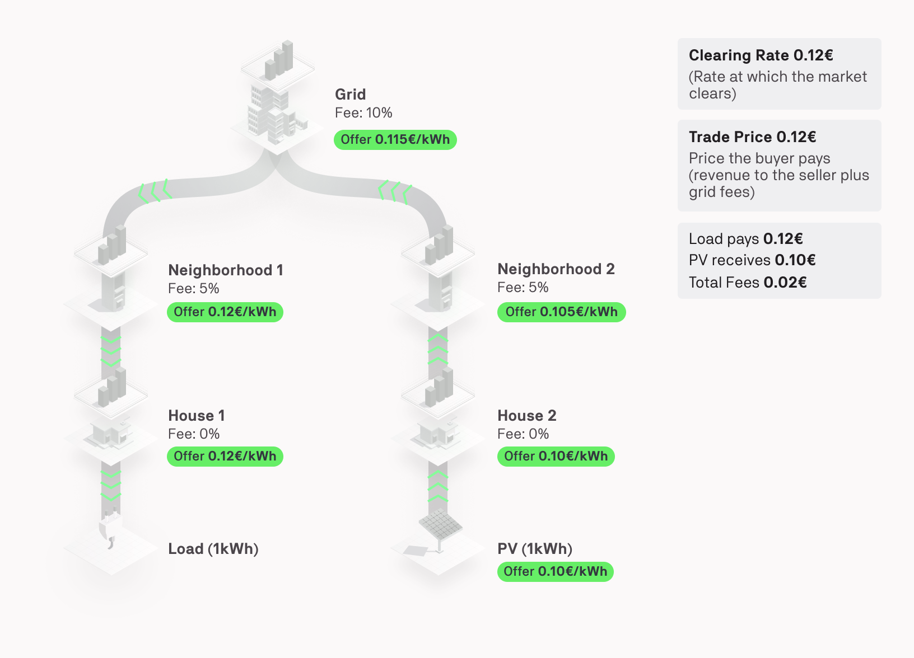

The percentage grid fee is a market based fee, defined as a ratio (%) of the clearing price that is added to each trade that is cleared, as shown in the figure below.



The price of a bid or offer changes as it is propagated into different markets to account for market fees. This way, a trading agent posting an offer will never receive less than offered and an agent making a bid will never pay more than bid.

##Example Calculation in One-Sided Pay-as-Offer Market





In the One-Sided Pay-as-Offer market, there are no bids, only offers. The offers are propagated throughout the markets in the hierarchy. The grid fees are taken into account when an offer is forwarded to the higher market, by the higher market itself. Therefore the agent is not responsible for adapting the offer price to include the grid fees. The grid fees' unit is a ratio of the original offer price, therefore the formula to calculate the new offer price when placing an offer to a market is the following:

```
offer_price_after_fees = offer_price + original_offer_price * grid_fee_ratio
```

If the offer is not purchased after two ticks, it is moved into the next market, where the price is increased by that market’s grid fee. In the provided example, the PV offer of 0.10€ is first placed in the House 2 Market where it gains zero fees. Then it propagates into the Neighborhood 2 Market, gaining the market’s fee of 5% of the original offer price `0.10*0.05+0.10=0.105€`.  If unmatched, it propagates into the Grid Market, with an additional 10% fee of the original offer is applied: `0.10*0.10+0.105=0.115€`. Continuing into the Neighborhood 1 Market, the offer gains another fee of 5% of the original price `0.10*0.05+0.115=0.12€`. Continuing into the House 1 Market, the offer gains zero additional fees as there is no fee in that market. The Load buys the offer in the House 1 Market at the Clearing Price of 0.12€. Starting with the initial offer price, the total fees are calculated  `0.10*(1+0.05+0.10+0.05)=0.02` to yield the Trade Price of 0.12€.

The Load pays the Trade Price of 0.12€, which includes 0.10€ revenue for the PV, 0.005€ fees for the Neighborhood Market 1, 0.01€ fees for the Grid Market, and 0.005€ fees for the Neighborhood Market 2.

Since the market type is pay-as-offer, the offer rates are used as ‘clearing’ rates. The trade price is then calculated by multiplying the clearing rate with the energy volume. For each market trade, the market grid fee is calculated based on the original offer rate and it is subtracted from the trade_price, in order to calculate the trade price after fees (and thus the revenue for the seller). The following formula is used:

```
market_fees = grid_fee_ratio * original_rate * energy_portion
trade_price_after_fees = energy * trade_rate - market_fees
trade_price = energy * trade_rate
```

##Example Calculation in Two-Sided Pay-as-Bid Market


In the Two-Sided Pay-as-Bid market, both bids and offers are propagated through the markets in the hierarchy. If a bid or offer is not purchased after two ticks, it propagates into the next market. In order to prevent double accounting of a market's grid fee when a bid and an offer are matched in that market, market fees are added to offers when they enter that market (target market) and subtracted from bids when they leave that market and enter another (source market). The formula for propagating the offers is the same as for the one-sided market:

```
offer_price_after_fees = offer_price + original_offer_price * grid_fee_ratio
```

The IAA subtracts the fees from the bid before propagating it to a higher market. The formula for an area to update the bid to include grid fees is the following: 

```
bid_price_after_fees = bid_price - original_bid_price * grid_fee_ratio
```

In the case of the Two-Sided Pay-as-Bid market, the offer has moved into the Grid Market by the same mechanism as for the One-Sided Pay-as-Offer market. The bid of 0.30€ follows a similar mechanism and is placed into the House 1 Market where there are zero fees. If the bid is not purchased after two ticks, it is moved into the Neighborhood 1 Market. As explained above, only the fees from the source market are added, which are zero in this case. Hence the bid remains at 0.30€. Next, the bid is moved to the Grid Market, and incurs the fees of the source market, the Neighborhood 1 Market of 5% to `0.30-0.30*0.05=0.285€`.

In the example above, the bid and offer are matched in the Grid Market. When the offer entered the Grid Market, its price was immediately updated to account for the Grid Market's fees `0.10*0.10+0.105=0.115€`. The bid, however, did not add the 10% fee as only the fees from the source markets are added. In the case that the bid was not matched in the Grid Market and moved into the Neighborhood 2 Market, the 10% fee from the Grid Market would be added to the bid. In this case, the bid would become `0.285-0.30*0.10=0.255€`. 

In the Grid Market, the Load bid is listed as 0.285€ and the PV offer is listed as 0.115€. As the bid rate is greater than the offer rate, a trade can be scheduled. The trade clears at the bid rate, resulting in a Clearing Price of 0.285€.

The algorithm to calculate the final grid fees for each trade is decentralised, allowing the markets to act more independently without having to share information regarding their fees with other markets. In order to calculate the fee correctly based on the original price, the algorithm needs to be able to calculate the supply side and demand side fee. It is easily calculated using the most recent forwarded rate and the original bid or offer rate:

```
demand_side_fee = 1 - (forwarded_bid_rate / original_bid_rate)
supply_side_fee = (forwarded_offer_rate / original_offer_rate) - 1
```

The provided example has the following values: 

```
supply_side_fee=(0.115/0.1)-1=0.15
demand_side_fee=1-(0.285/0.3)=0.05
```

After calculating the supply and the demand side fee, the trade revenue can be determined. Note the original_trade_rate is the amount that the original buyer (in our case the Load) will need to pay, and therefore the original bid price in a Pay-as-Bid market. The formula is the following:

```
total_fee_ratio = supply_side_fee + demand_side_fee
revenue = original_trade_rate / (1 + total_fee_ratio)
```

In the provided example, `revenue = 0.30/(1+0.15+0.05)=0.25`

The grid fees are then calculated based on the revenue and the individual market fees:

```
fees = revenue * grid_fee_ratio
```

For the Grid Market in the provided example, the fees are `0.25*0.1=0.025`, and for each Neighborhood market, the fees are `0.25*0.05=0.0125`.

Finally, the trade rate is adapted according to include the supply side grid fee, in order to include the fees of the current market:

```
trade_rate = revenue * (1 + supply_side_fee)
trade_price = energy * trade_rate
```

In the provided example, the trade price for each market is:
```
Grid Market = 0.25 * (1 + 0.15) = 0.2875
Neighborhood 2 Market = 0.25 * (1 + 0.05) = 0.2625 
Neighborhood 1 Market = 0.25 * (1 + 0.2) = 0.3
House 1 Market = 0.25 * (1 + 0.2) = 0.3
House 2 Market = 0.25 * (1 + 0) = 0.25
```

The Load pays the Trade Price of 0.30€, which includes 0.25€ revenue for the PV, 0.0125€ fees for the Neighborhood Market 1, 0.025€ fees for the Grid Market, and 0.0125€ fees for the Neighborhood Market 2.

##Example Calculation in Two-Sided Pay-as-Clear Market

This market clearing type is currently in development. We welcome your suggestions on its design!
