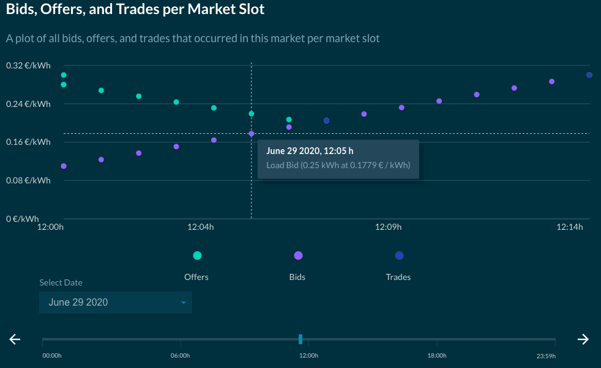
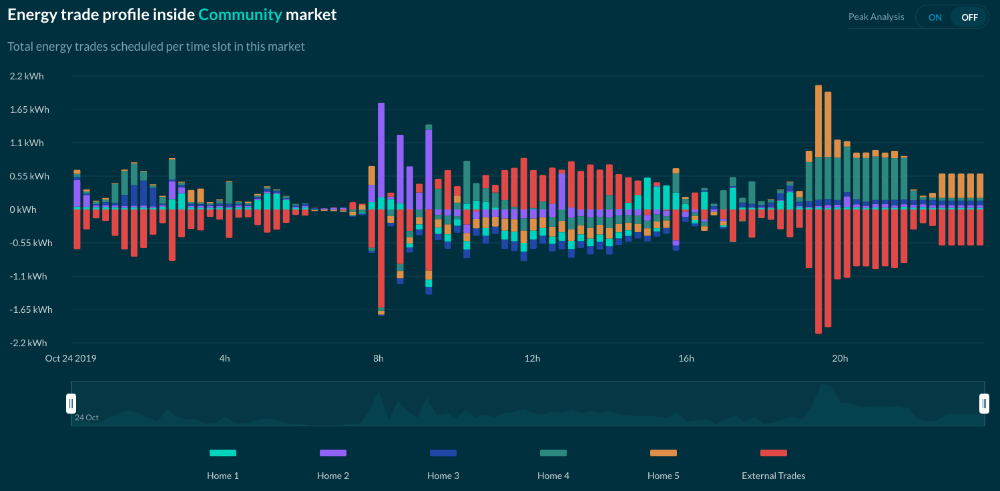

## Navigating your configuration grid

The D3A allows energy resources to trade inside energy markets. During trading, the user can view what is happening at the energy resource level and at the market level. 

Since a D3A grid is build up into a hierarchy of multiple markets, we use a folder structure to navigate through the grid simulation results. 

The user can select a **market**, which brings the user to the result page of this specific market;

or, you can select an **energy resource** (located inside a market) to bring the user to the results page of this specific energy resource.

In the above figure, the community market is selected.

------

## Simulation Results

When selecting a market, the results page will show you various relevant plots and tables. You also have the possibility to select which one you want to view/hide (by default all of them are visible). This section will discuss each of these results.

{:style="height:450px;width:230px"}

### Energy Availability

This plot shows whether or not each energy resource inside the selected market had access to the energy it needed. On the x-axis, the time is given. If the participating agent was able to get the energy it wants, at a certain time, the block at that time will appear green. If not, it will appear purple.

The granularity of the plot is 1 hour, so if there has been a trade interval (possibly <1 hour length) within the hour in which the agent was not able to buy the demanded energy, the whole block will turn purple. The user can hover over a purple block to see a list of the energy resources not able to buy for that time slot.

### Self sufficiency and consumption

These 2 pie charts shows the Self Sufficiency and Self Consumption of the selected area. Please see [Key Performance Indicators](kpis.md#self-sufficiency-self-consumption) for more information.

### Cumulative trading

This plot shows the total trade volumes that have been traded between market participants in the selected market over the simulation's duration. Market participants are the agents (representing an energy resource or an area) immediately inside the selected market.

Each bar has its own color to represent its sold energy. Energy sold is negative and energy bought is positive. In this example, the energy sold by House 1 is purple. House 1 also has a positive purple bar, meaning that it bought some of its own energy production. The rest of its energy production was sold as the thin purple layer shown in the bar of the other market participants. By using this color coding, the user can visually track how energy has flowed in a specific market.

The external trades represent energy produced in this market, but sold to an outside market (the positive bar layers containing the colors of each participant) and the energy bought from an external source and sold to a participant in this market. The energy bought externally is teal in this example and is the negative bar for External Trades. This energy was sold to the other participants where a positive teal colored bar can be seen (all participants).

### Energy bills and net energy

The energy bills provide information on the cumulative trade volumes of all market participants and the costs associated with these trades. For each agent, including the external trades, the energy bought and sold during the simulation is listed, along with a total net consumption.

The *Totals* column can be considered as the net energy consumption and final bill to the listed agent, which may represent an energy resource or an area of ownership.

*External Trades* represents the import/export from/to a higher level market by the inter-area agent of the selected market, and hence represents the difference between energy traded inside the community and the total accumulated trades.

The *Totals* row represents the total of trades that are made by the agents inside the selected area. 

In this example, we have the *Community* market selected. In the *Community* market, the participating agents are the inter-area agents of the houses that lie inside of the community area. 

### Energy trade profile

The energy profile shows both the demand-side as supply-side of the trades made inside the selected market for every market interval of the simulation. The negative side of the y-axis represents the energy sold, and the positive y-axis shows the energy bought. The different colors represent the different agents. 

As all buyers and sellers of each trade are accounted for in a select market, the supply and demand sides should be exact mirrors of each other in terms of volume. 

If *peak analysis* is switched on the external trades are hidden and only the demand and supply of the current area's agents remain. 

On this plot 2 lines are shown : the *current peak imports* and the *current peak exports* which represent the maximum energy imported and exported for the selected area (here the *Community*).

### Detailed energy trade profile

This graph is a high resolution energy trade profile. With this graph the user can select a specific [market slot](market-slots-and-ticks.md) in order to see precisely when each trade was cleared during that slot, with a resolution of 1 minute. The graph's length is the market slot length (15 minutes by default). Every market slot of the simulation can be selected with the drop down (for the date) and the slider (for the time).

### Energy pricing

In this plot, energy pricing is shown. In case of multiple clearing moments within a market interval (depending on market design and grid configuration), there could be different prices for different trades in the market interval. In this case, an average of the trade price is shown.  

In addition, the minimum and maximum price on that time of the day for all days of simulation is provided.

If there was no trade happening during a certain market interval, the price is set to zero at that time. 

### Bids, Offers, and Trades per Market Slot

In this plot every [bids, offers](how-strategies-adjust-prices.md) and trades posted in the selected market is shown according to their posting time. With this graph the user can understand why specific offers/bids were matched or not and thus adapt their trading strategy. The range of this graph is the [market slot](market-slots-and-ticks.md) length (15 minutes by default). Every market slot of the simulation can be selected with the drop down (days) and the slider (hours & minutes). 

## Compare results

The user has the possibility to compare the results to another simulation (in order to compare results, the simulation should already have been run). The user can also download the results using the interface shown below:

## Settings

The user have the possibility to **duplicate** the setup, **download** the results of their simulation or **delete** the configuration:

{:style="height:50px;width:50px"}
