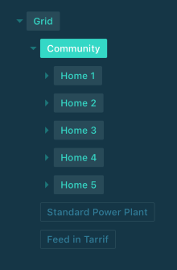
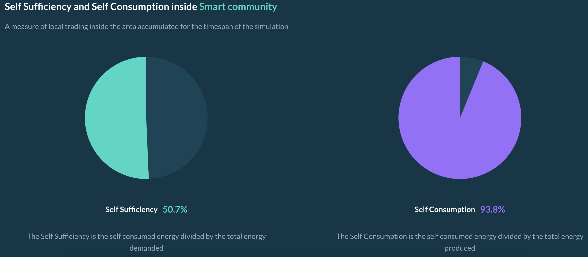
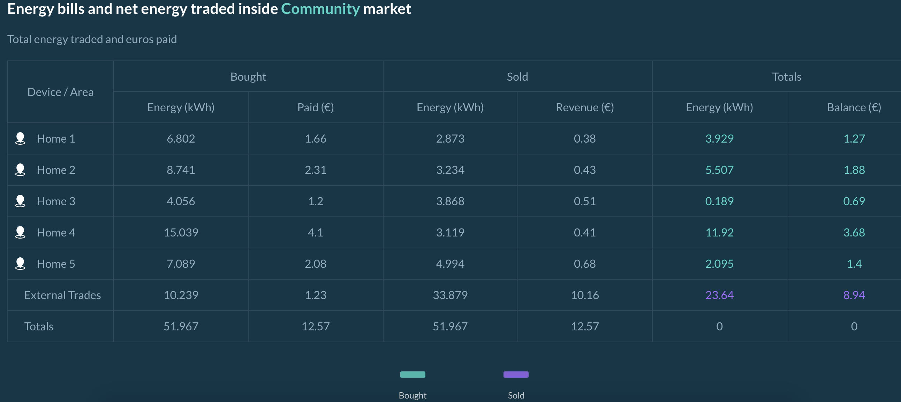
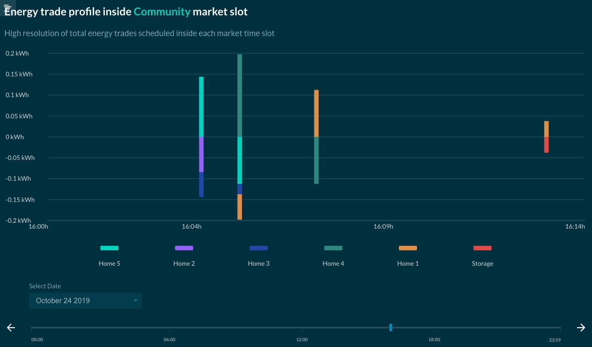
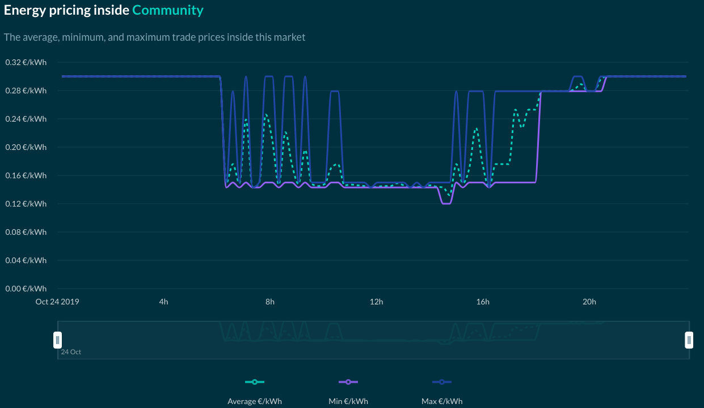

##User Interface Results

Grid Singularity’s UI (d3a.io) offers visual representations of simulation results. These are updated while the simulation is running and stored indefinitely until the user decides to delete or to rerun the simulation. The user is able to view Results for each area or asset in the grid configuration.

###Navigating the grid configuration in the UI

As shown in the image above, the user can select a **market** or an **energy asset** from a drop down to view specific results for that market or an asset while on the Results page. In the figure above, the Community market is selected.

{:style="height:550px;width:250px"}

The Results page then displays relevant plots and tables for the selected market or asset. There is also the possibility to select which charts / tables you want to view / hide, as shown in the image above. This section discusses the information available in each chart / table.

###Energy availability

This plot shows whether each consuming energy asset (i.e. load) inside the selected market had access to the energy it needed for each market slot. On the x-axis, the time is given. If the participating asset agent was able to purchase the energy it required for that time slot, the block will be colored **green**. If not, it will be colored **purple**.

The granularity of the plot is **one hour**, so if there was a trade interval within the hour in which the agent was not able to buy the demanded energy, the entire block will be colored purple. The user can hover the cursor over a purple block to view a list of the energy assets that were not able to buy energy in that time slot.

###Self-sufficiency and self-consumption

These two pie charts display Self-Sufficiency and Self-Consumption level of the selected area. Please see [this page](self-sufficiency-consumption.md) for more information. When the user hovers the cursor over these plots, the following quantitative energy metrics are shown:

*   Self-consumed energy [kWh]
*   Total demanded energy [kWh]
*   Total produced energy [kWh]

###Cumulative trading

This plot shows the total cumulative trade volumes traded among market participants (agents representing assets or markets) in the selected market in the course of the simulation. 

Each market participant is displayed as a uniquely colored bar that represents the energy sold (shown as negative) or bought (shown as positive). In the example below, the energy sold by House 1 is colored purple, and the House 1 bar is positive, meaning that it bought some of the energy it produced for its own use (self-consumption). The rest of the energy it sold is shown as a thin purple layer appearing in the bars of the other market participants that acted as buyers. This color coding allows the user to visually track the energy trade flows in the selected market.

External Trades represent the import/export from/to a higher level market by the Inter-area agent of the selected market, and hence the difference between energy traded amongst the selected market participants and the total accumulated trades.

The `external trades` bar represents energy produced in this market, but sold to an outside market, as well as the energy bought from an external source and sold to a participant in this market. The energy bought externally is teal in this example and the bar is negative for external trades. The energy that was sold to other market participants is indicated by a positive teal colored bar. A negative external trades bar means that the participants within the select market purchased energy externally and a positive external trades bar means that participants sold energy to an external market.

###Energy bills and net energy

In the Community market shown in the figure below, the participating agents are the inter-area agents of the houses that lie within that market.

The energy bill table provides information on the cumulative trade volumes of all market participants and the costs associated with trades. For each market and energy asset, the energy bought and sold during the simulation is listed, along with a total net energy consumption. The `Totals` column can be considered as the **net energy consumption** and **final bill** for the listed agent, which may represent an energy asset or a market (e.g. a house).

The `Totals` row represents the total of trades that are made by all participants inside the selected market.

###Energy trade profile

The energy profile shows the **supply** and **demand** of trades made inside the selected market for each market slot of the simulation. The negative side of the y-axis represents the energy sold, and the positive y-axis shows the energy bought. The different colors represent the different market participants (energy assets and markets).

As all buyers and sellers of each trade are accounted for in a select market, the supply and demand sides are exact mirrors of each other in terms of volume.

If `peak analysis` is switched on, the internal trades are hidden and only the trades including external participants are displayed. This shows how much energy required the use of transmission lines outside of the selected market.

On the `peak analysis` plot, two lines are shown: the `current peak imports` and the `current peak exports`, representing the **maximum** energy imported and exported for the selected market.

Another feature of this graph is viewing the **Net energy**, shown below.

When `peak analysis` is activated, only net external trades of each participant are displayed. The net displays the difference between the total import and export for each market slot, useful in understanding the impact to **transmission capacity**.

###Detailed energy trade profile

This graph is a market slot level breakdown of the energy trade profile. With this graph, the user can select a specific [market slot](markets.md) to see when each trade was cleared during that slot, with a resolution of 30 simulated seconds. The graph's length is the market slot length (15 minutes by default). The market slot can be selected with the drop down (days) and the slider (hours and minutes).

###Energy pricing

In this plot, energy pricing is shown. Depending on market design and grid configuration, there could be different price settlements in the same market slot. In this case, a `minimum`, `maximum`, and `average` of the trade price is shown.

If no trade occurred during a certain market interval, no lines are plotted. If [grid fees](grid-fees.md) are set in that market as a constant value, a fourth line is plotted to reflect its price.

###Bids, Offers, and Trades per Market Slot

In this plot, each bid, offer and trade posted/cleared in the selected market is shown according to its posting/clearing times, allowing the user to analyse how specific offers/bids were or were not matched and validate or further investigate their trading strategy. The x-axis of this graph is the market slot length (15 minutes by default), and the y-axis shows the bid and offer price. Each market slot of the simulation can be selected and viewed with the drop down (days) and the slider (hours & minutes).

###Compare results

The user has the possibility to compare the results of two separate simulations. The user can also **duplicate** the simulation setup, **download** results or **delete** the configuration by using the appropriate buttons shown below:

##Backend Results

After running a simulation in the backend, the user can export simulation results. This functionality is enabled by default. If you want to disable the export of simulation results, use the `--no-export` flag for the simulation run. Another useful parameter is: `--export-path`, used to change the output path of the simulation results. The default path is `$HOME/d3a-simulation/`.

The simulation results include analytical information about the bids, offers and trades that took place in the course of the simulation. Information about energy characteristics of each asset and [market](model-markets.md) are also included (eg. battery state of charge, energy traded/requested/deficit). A detailed description of these files is available on the data download page.

In addition to text files, some graphs that display aggregated market information during the course of the simulation are also exposed. These can be found under the `plot` directory and are very similar to the ones available in the UI :

*   **unmatched_loads_*.html**: Plots the volume of energy that loads have not been able to purchase (power outage)
*   **energy_profile_*.html**: Similar plot to energy trade profile
*   **average_trade_price_*.html**: Similar plot to energy pricing
*   **asset_profile_*.html**: each energy asset within the simulation has its own plot showing its profile (consumption, generation, State of Charge), the actual energy traded and energy rates.