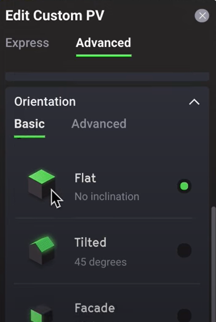
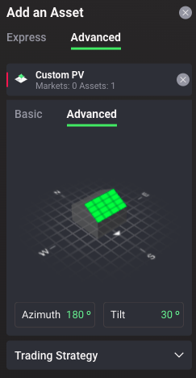

A photovoltaic (PV) module is an energy asset that converts solar irradiation into electricity. In our software, each PV component already includes the DC to AC conversion, and can represent a single module, array of modules or an entire solar park (users can select the total capacity in the advanced PV settings). They can be added to homes or a community. PVs produce electricity to be self-consumed by the asset owners, sold to another member of the community, sold back to the grid, or stored in a battery for use at a later time, depending on what options are available to the owner. In the Singularity Map, the “Custom PV” tool allows users to quickly simulate a PV generation at a specific location and orientation. This tool uses the backend code of the [Energy Data Map](https://energydatamap.com/) provided by [rebase.energy](https://www.rebase.energy/). Additionally template PV generation profiles from different cities are available to users (also generated using data from the [Energy Data Map](https://energydatamap.com/) based on the selected geographical location and weather profile). Users can either add template PV profiles to their homes or communities or they can upload their own PV data by using the ‘override profile’ section in the PV advanced settings, after initially selecting a template PV.

***Figure 2.8***. *Express Mode PV Options*

##Asset Configuration Options

***Express Mode***

1. Name - Must be unique
2. Geo-tag - This automatically uploads the location a user selects

***Advanced Mode***

1. Capacity and Profile

    1. Capacity - Total kW capacity of the PV system
    2. Solar Profile - Users can choose one of the following options:
        1. Local generation profile - This is the default setting and represents the PV production based on asset location,  derived by connecting to the [Energy Data Map](https://energydatamap.com/) API provided by [rebase.energy](https://www.rebase.energy/).
        2. Sunny, partially cloudy, cloudy - Template profile representing one of the 3 different weather types (1 day profile).
        3. Gaussian - PV profile where the maximum generation value is the defined PV capacity.
        4. Upload their own custom generation profile by providing a [csv file](data-requirements.md).

2. Trading Strategy
    3. Initial selling rate - Users can choose the initial (and maximum) rate that the PV offers at the beginning of each market slot in cents/kWh. Select the [Market Maker](grid-market-settings.md) rate or create your own custom rate by selecting ‘user input’.
    4. Final selling rate - Users can choose the final rate that the PV offers at the end of each market slot in cents/kWh.
    5. Rate decrease - Users can enter a value for the explicit rate decrease increment in cents/kWh.
    6. Fit to limits - If activated, a rate decrease per time is calculated, starting at Initial Selling Rate and ending at final Selling Rate, while updating the rate at each Update Interval. Users can derive [bidding behaviour](default-trading-strategy.md) from a linear fitted curve of a selling rate ranging from initial_selling_rate to final_selling_rate within the bidding interval. If activated, energy_rate_decrease_per_update = (initial_selling_rate - final_selling_rate) / max(int((slot_length / update_interval) -1), 1)
    7. Update interval - Choose the frequency at which the rate is updated.

3. Orientation - If the Local Generation Profile is selected as a Solar Profile, the parameters describing the orientation of the solar panels can be set. There are 2 options:
    8. Basic: User select one of the 3 options (Flat, Tilted or Facade)
    9. Advanced: User sets the tilt and azimuth in degrees

{: style="height:500px;width:300px"}

***Figure 2.9***. *Selection of PV orientation*

{: style="height:500px;width:300px"}

***Figure 2.10***. *PV Advanced Configuration Options*

The integration of the Energy Data Map API with the Grid Singularity Exchange (Custom PV tool feature) was designed and developed in the scope of the EU-supported [AI4Cities](https://gridsingularity.medium.com/grid-singularity-and-rebase-energy-awarded-2021-ai4cities-grant-4e0aa1cf3240) project.
